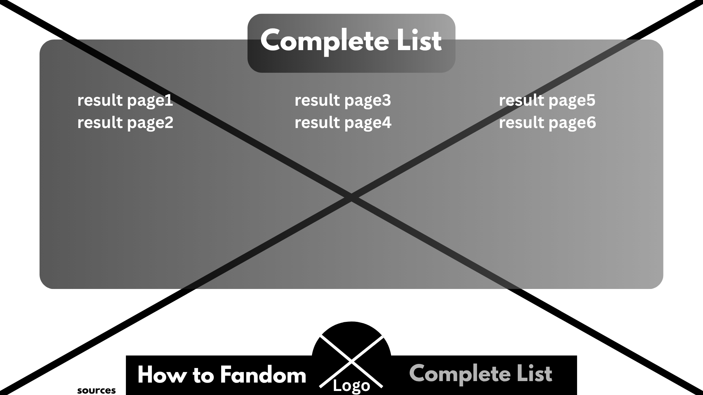
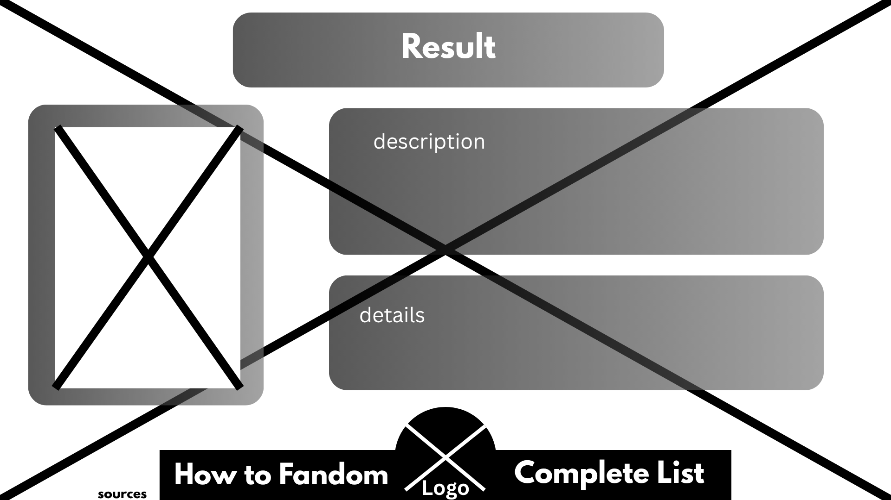
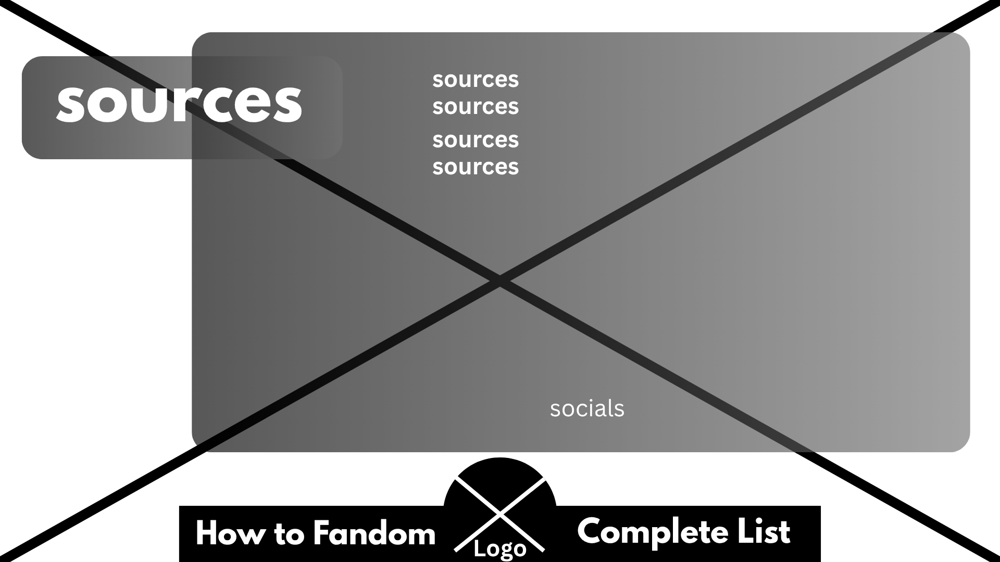
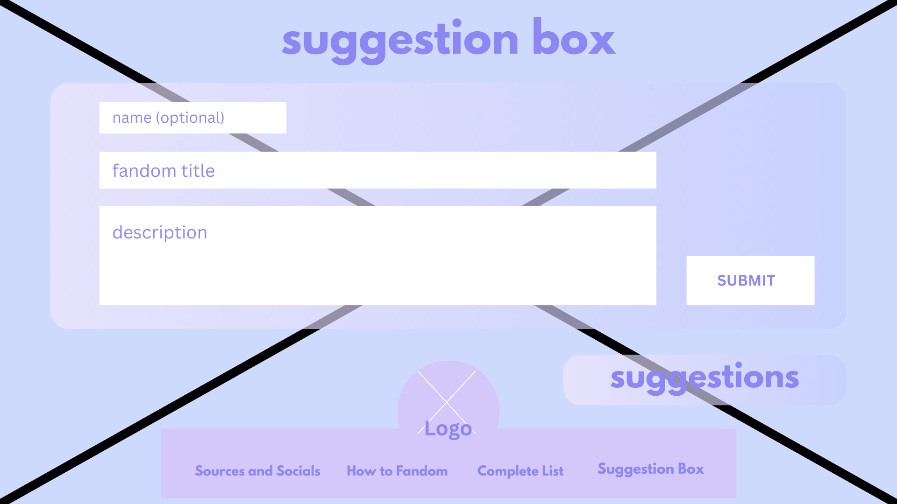
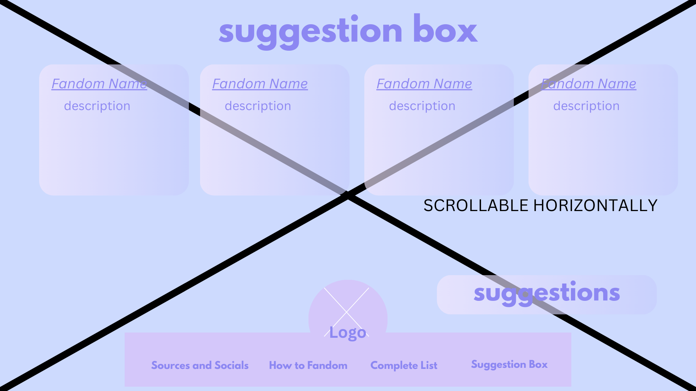
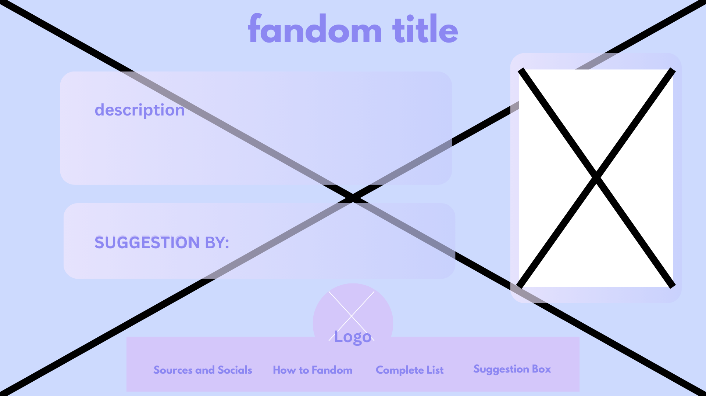

# Final Proposal

## Fandom Roulette
Want to find new content to dip your fingers in? We've got you covered! With the press of a quick button, we can randomly generate a fandom that might interest you, be it a book, show, or game!

This project is for anyone who wants to find new and interesting media, or to branch out their interests. They would love this project since it allows them to find newer fandoms with just one button, rather than having to do it manually.

This project features
- A completely random experience based on the click of a button
- Lists of suggestions from other users
- A suggestion box that you can add your own fandoms in
- Mobile Compatibility

and does not feature
- any spoilers for any of the fandoms!
- calculator
- world map

Submitted By Emma Noelle M. Tancinco and Xian Elric C. Yu on 18 March 2026 to Sir Roy Vincent Canseco in partial fulfillment of the requiements in CS3 of DOST-PSHS-MC

## Wireframes
Home Page:

How to join a fandom:

Complete list:

Result Pages:

Sources:

Suggestion box

Suggestions List

New Fandom Suggestions

---

# Q3 Proposal Update

## Final Title: fandom roulette

## Features
1. Uses JavaScript to randomize possible fandom results
2. Allows users to suggest fandoms to add to the website
3. Users can rate fandoms, and all ratings will be compiled and presented in each webpage
4. Compatible with both phone and laptop

## Details
- The form will be accessible in the Navigation Bar, titled Suggest Box
- The data will be collected and utilized to create new fandom websites, at the discretion of the website creators

## Definition of Done

Has at minimum 30 different fandom websites, has a working log-in system which allows users to rate each fandom, and there is a functioning user-input form.

Suggestion box

Suggestions List

New Fandom Suggestions

---

# Fandom Roulette
> Random Reality Roulette (RRR)

Favicon: 

Bored in the summer? Want to take a break from schoolwork? Don't worry! We've got you covered! With the press of a quick button, we can randomly generate a fandom that might interest you, be it a book, show, or game!

__Home__ (Includes Random Button, will incorporate JS, when button ROLL is tapped, it will open a random _Results Page_)

__Complete List__ (Don't want it random? Sure, here's a list of all of the fandoms!)

__How to join a Fandom__ (Contains basic steps on how to start your deep dive into a new world!)

__Sources__ (Contains sources and citations, also social media links)

__Result Pages__ - Each possible fandom result will have their own seperate webpage. Ideally with no sub-pages

## Wireframes
Home Page:

How to join a fandom:

Complete list:

Result Pages:

Sources:

